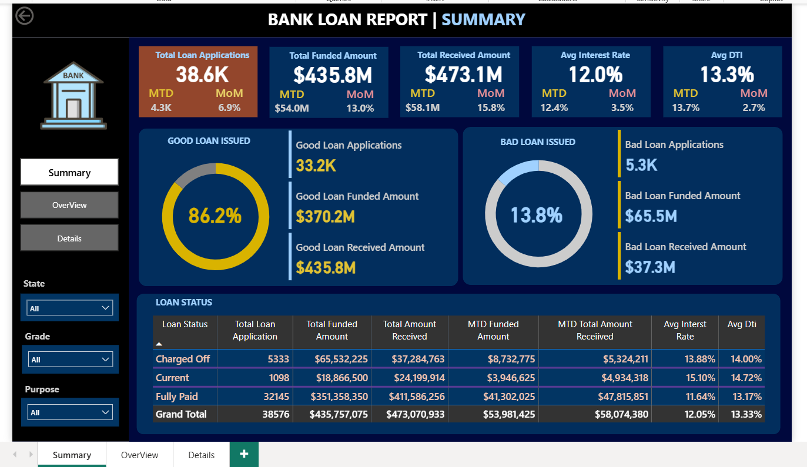
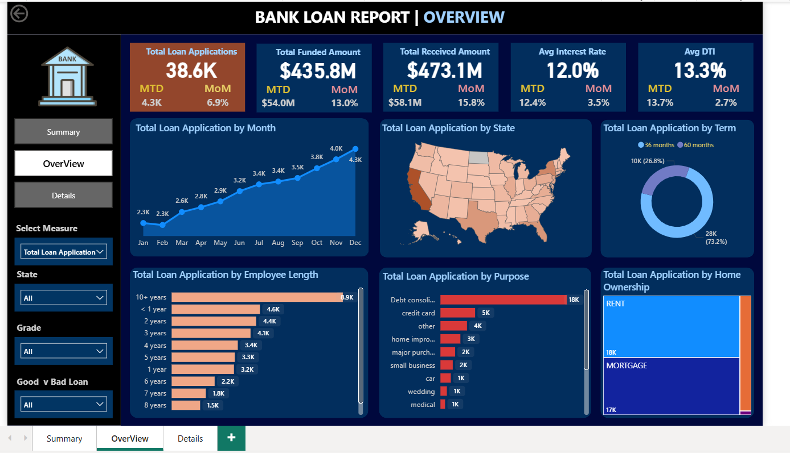
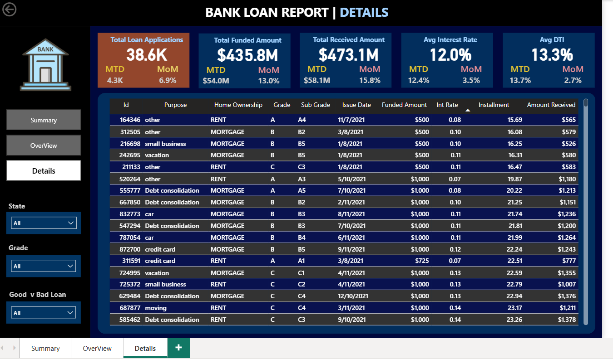

# 🏦 Bank Loan Analytics Dashboard — Power BI + SQL

An end-to-end bank loan performance analysis built with **SQL** for data processing and **Power BI** for interactive visualization. The project turns raw loan-level data into a KPI-driven dashboard that evaluates loan health across regions, purposes, and borrower segments, distinguishing **Good Loans** from **Bad Loans** for lending-decision insight.

## Project Overview

The dashboard answers questions a lending team would actually ask:

- How many loans have been issued, how much was funded, and how much has been repaid?
- Which regions, loan purposes, and terms perform best?
- What share of the portfolio is healthy (Good Loans) vs. at risk (Bad Loans / Charged Off)?
- How do interest rate and debt-to-income ratio vary across loan status?

It's built as a 3-page report: an executive summary, a trend/segment overview, and a record-level detail view for auditing individual loans.

## Tools & Technologies

| Tool | Purpose |
|---|---|
| SQL | Data aggregation, KPI computation, MTD/PMTD comparisons |
| Power BI Desktop | Data modeling and interactive dashboard |
| CSV (`financial_loan.csv`) | Source loan-level dataset |

## Dataset

`financial_loan.csv` — one row per loan, with fields including:

| Column | Description |
|---|---|
| `id` | Unique loan ID |
| `loan_status` | Fully Paid / Current / Charged Off |
| `loan_amount` | Amount funded |
| `total_payment` | Amount repaid to date |
| `int_rate` | Interest rate (%) |
| `dti` | Debt-to-income ratio |
| `purpose` | Reason for the loan |
| `emp_length` | Borrower's employment length |
| `address_state` | Borrower's state |
| `term` | Loan duration (36 / 60 months) |
| `issue_date` | Loan issue date |

## Key Performance Indicators

| KPI | Value |
|---|---|
| Total Loan Applications | 38.6K |
| Total Funded Amount | $435.8M |
| Total Amount Received | $473.1M |
| Average Interest Rate | 12.0% |
| Average DTI | 13.3% |
| Good Loan % (Fully Paid / Current) | 86.2% |
| Bad Loan % (Charged Off) | 13.8% |

## Dashboard Pages

### 1. Summary — Executive Portfolio View
KPI cards for applications, funded/received amounts, average interest rate and DTI, with MTD vs. previous-month comparisons and a Good vs. Bad Loan breakdown.

### 2. Overview — Trends & Segments
Monthly application trends, a state-level map of loan activity, and breakdowns by purpose, term, employment length, and home ownership. Slicers for state, grade, purpose, and loan status.

### 3. Details — Record-Level View
A filterable table of individual loans (ID, purpose, grade, funded amount, interest rate, amount received) for auditing specific records and investigating non-performing loans.

## SQL

All KPI and segment queries used to build the model are documented in [`sql queries with result.docx`](sql%20queries%20with%20result.docx), covering:

- Portfolio summary metrics (applications, funded/received amounts, rates, MTD/PMTD)
- Good loan vs. bad loan breakdowns
- Loan status summary
- Monthly, state-wise, term-wise, purpose-wise, and home-ownership segment analysis

## How to Reproduce

1. Clone this repo.
2. Load `financial_loan.csv` into your SQL environment (or directly into Power BI).
3. Run the queries in `sql queries with result.docx` to validate the KPIs.
4. Open `Power Bi DashBoard.pbix` in Power BI Desktop, refresh the data connection, and explore.

## Notes

This project uses the widely-used public "Bank Loan Analysis" practice dataset commonly used to learn SQL + Power BI end-to-end workflows. The data modeling, DAX measures, dashboard layout, and SQL queries in this repo were built independently as a hands-on exercise in loan portfolio analysis.

## Author

Adam IMLOUL — [GitHub](https://github.com/adamfutur) · [LinkedIn](https://www.linkedin.com/in/adam-imloul)
